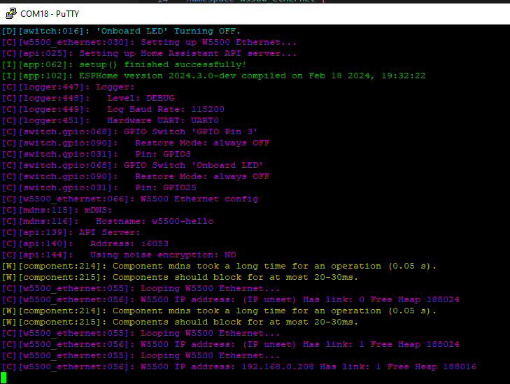
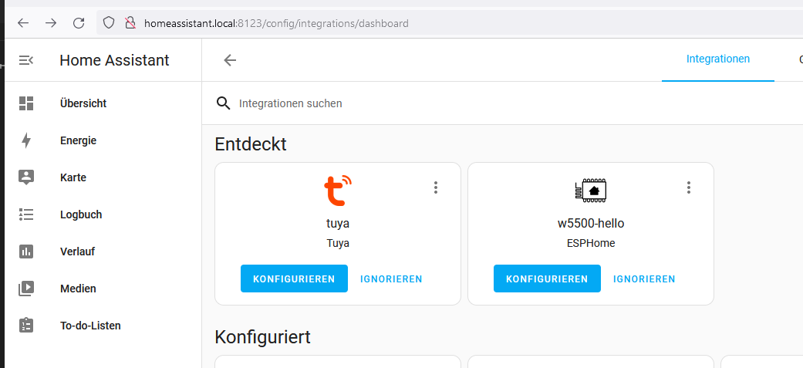
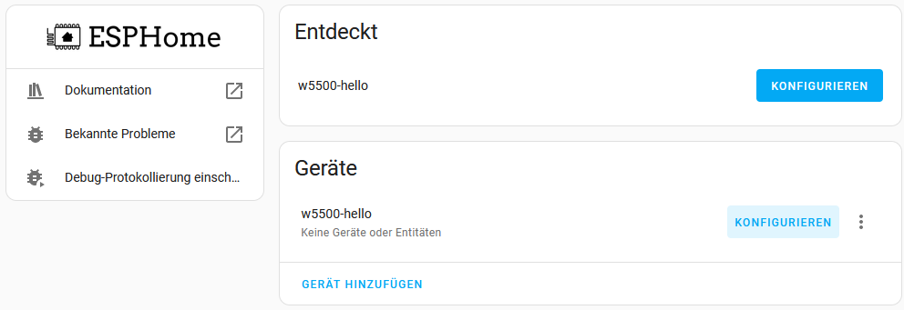
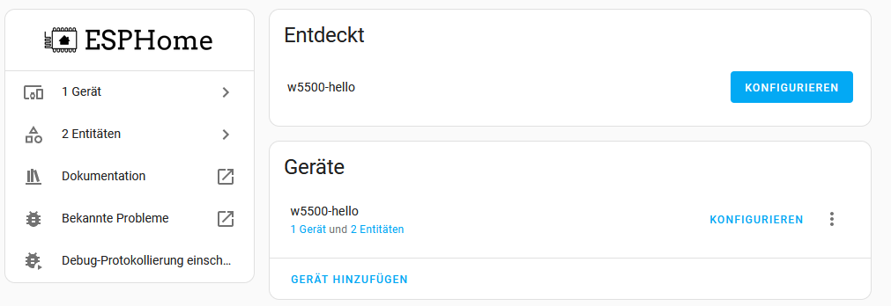
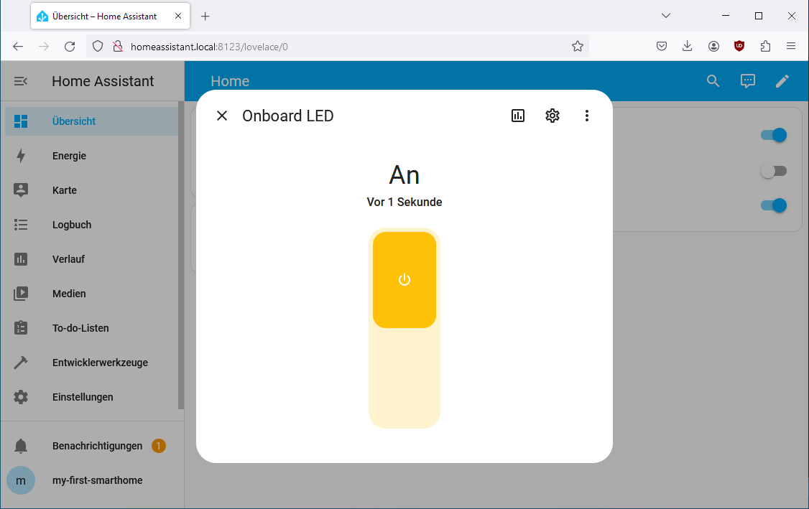

# WIZnet W5000-EVB-Pico + ESPHome

## Description

This repository shows the usage of a standard WIZnet W5500-EVB-Pico board with ESPHome.

Currently, mainline ESPHome does not support the `W5500lwIP.h` library that Arduino-Pico uses to integrate the W5500 chip into its lwIP subsystem.

A small, self-written `w5500_ethernet` custom ESPhome solves that problem. It essentially starts up the chip and begins the DHCP process, in about 15 lines of core code.

A small modification to ESPHome itself was also needed to make the `network` component recongize this new Ethernet component properly. Otherwise, the `api` component, which enables the HomeAssistant integration, cannot be actiated. The diff can be found [here](https://github.com/esphome/esphome/compare/dev...maxgerhardt:esphome:dev).

## Building and Flashing

It is assumed you have VSCode + PlatformIO installed the regular way.

First of all, you **must** use the custom ESPHome version found forked at `https://github.com/maxgerhardt/esphome/`. This requires you to either uninstall your previous esphome version (`pip uninstall esphome`) or create a new virtual Python environment which is decoupled from your main system.

In any case, install the ESPHome version using
```bash
pip install "https://github.com/maxgerhardt/esphome/archive/refs/heads/dev.zip"
```

this should enable the `esphome` commands in your commandline.

Next, let ESPHome generate the PlatformIO project based from the YAML configuration file using
```bash
esphome compile --only-generate w5500-hello.yml
```
This will generate a `.esphome/build/w5500-hello` folder.

You can open that folder in VSCode as a regular PlatformIO project and use the "Build" and "Upload" buttons as needed and [documented](https://docs.platformio.org/en/latest/integration/ide/vscode.html#project-tasks).

You can also directly make ESPHome compile and upload the firmware, given that [PlatformIO shell commands](https://docs.platformio.org/en/latest/core/installation/shell-commands.html) are installed, using simply

```bash
esphome run w5500-hello.yml
```

## Check that the firmware is running

The firmware has enabled logging and should periodically print the IP address to the console. Use the regular "Monitor" task in PlatformIO, or a serial program like [HTerm](https://www.der-hammer.info/pages/terminal.html) (**with** the "DTR" button pressed at 115200 baud!) or [PuTTY](https://putty.org/) to establish a connection to the serial logs.



Note to select the right `hardware_uart` option in the `w5500-hello.yml` file to direct the output to the USB port or the UART header (GP0 pin).

If the firmware is running, you should also be able to `ping w5500-hello.local` correctly.

## Integration into Home Assistant

It is herein assumed that you have installed Home Assistant on some device or server. For this example, I use VirtualBox on my Windows machine per [these instructions](https://www.home-assistant.io/installation/windows/) to boot up an instance of Home Assistant at http://homeassistant.local:8123.

If the board has properly started up, it should automatically become visible in the Home Assistant "Settings -> Devices" dashboard as available device.



Press the "Configure" button on it, then further press Configure" buttons inside that until the device is all setup.

Press teh first "Configure" button:

Press the new lower "configure" button:

Now it should have detected "1 device and 2 entities":


If all done right, the main "Overview" page should now have the W5500 device with two preconfigured entities: "GPIO Pin 3" and "Onboard LED".


You can click on the "Onboard LED" text. In the controll window, you should be able to turn the on-board LED of the board on and off as you wish. The board should react accordingly.


